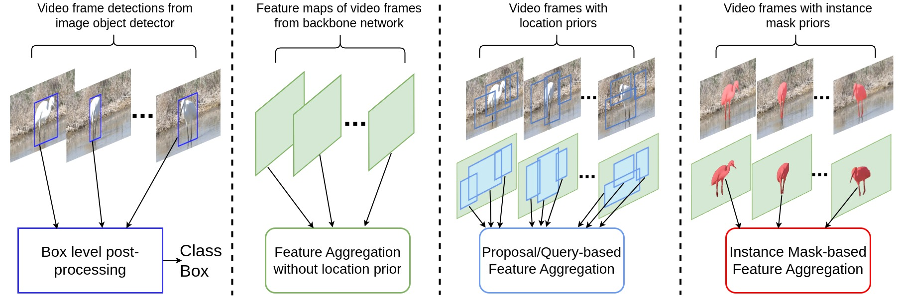
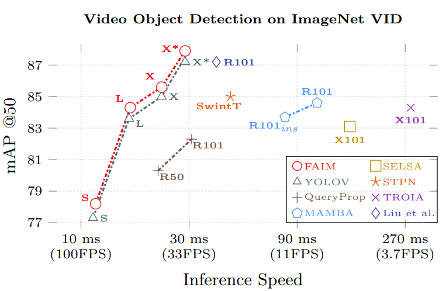

# Revisiting Temporal Feature Aggregation for Video Object Detection and Beyond


<p align="center">
  <span style="display: inline-block; text-align: center; width: 48%;">
    
    <br><br>
    <Strong>Introducing Novel Instance Mask-based Feature Aggregation Paradigm in Video Object Detection</Strong>
  </span>
  
</p>

<p align="center">
  
    <br>
    <Strong>Our demo results on Video Object Detection with FAIM (YOLOX) and Multi-Object Tracking with ByteTrack</Strong>
</p>

## Main Results 
YOLOV checkpoint can be accessed from [Here](https://github.dev/YuHengsss/YOLOV)

| Model                                                                                                                | mAP@50<sup>val<br> | Speed 2080Ti(batch size=1)<br>(ms) | Config                                                                                       |                                                   Checkpoint                                                   |
|----------------------------------------------------------------------------------------------------------------------|:------------------:|:----------------------------------:|-----------------------------------------------------------------------------------------------|:--------------------------------------------------------------------------------------------------------------:|
| YOLOV-S                                                                                                              |        77.3        |                11.3                | [Config](exps/yolov/yolov_s.py)                                                              |                                                                                                                |
| FAIM-S                                                                                                             |        78.2        |                11.6                | [Config](exps/faim/faim_s.py)                                                            | [Anonymous drive link ](https://drive.google.com/file/d/1OU2NaNOyiQLc8KS1Qp-JN8FPrmwRmo8X/view?usp=drive_link) |
| YOLOV-L                                                                                                              |        83.6        |                16.4                | [Config](exps/yolov/yolov_l.py)                                                              |                                                                                                                |
| FAIM-L                                                                                                             |        84.3        |                16.5                | [Config](exps/faim/faim_l.py)                                                            |     [Anonymous drive link ](https://drive.google.com/file/d/1GWr8ghwZeDnrz5V3vqYVxF-XQ8fnzYZH/view?usp=drive_link)                                                                                                           |
| YOLOV-X                                                                                                              |        85.5        |                22.7                | [Config](exps/yolov/yolov_x.py)                                                              |                                                                                                                |
| FAIM-X                                                                                                             |        85.6        |                22.7                | [Config](exps/faim/faim_x.py)                                                            |           [Anonymous drive link ](https://drive.google.com/file/d/1UjCyhWDuLIz6wmu0TApBMD5NVN51N0jx/view?usp=drive_link)                                                                                                     |
| YOLOV-X + [post](https://github.com/AlbertoSabater/Robust-and-efficient-post-processing-for-video-object-detection)  |        87.5        |                 -                  | [Config](exps/yolov/yolov_x.py)                                                         |                                                       -                                                        |
| FAIM-X + [post](https://github.com/AlbertoSabater/Robust-and-efficient-post-processing-for-video-object-detection) |        87.9        |                 -                  | [Config](exps/faim/faim_x.py)                                                       |                                                       -                                                        |


## Results on Multi-Object Tracking
### Results with Tracktor As Baseline
|      Method       | MOTA | IDF1 | FP | FN | IDSw. |                                                      Config                                                      |                                                                    Checkpoint                                                                    |
|:-----------------:| :--: | :--: |:--:|:--:| :---: |:----------------------------------------------------------------------------------------------------------------:|:------------------------------------------------------------------------------------------------------------------------------------------------:|
|     Tracktor      | 70.5 | 65.3 | 3659 | 176118 | 1442 | [config](MMtracking/mmtracking-0.11.0/configs/mot/tracktor/tracktor_faster-rcnn_r50_fpn_8e_mot20-public-half.py) | [Link from MMtracking](https://download.openmmlab.com/mmtracking/mot/faster_rcnn/faster-rcnn_r50_fpn_4e_mot15-half_20210804_001040-ae733d0c.pth) |
| **Tracktor+Ours** | 71.4 | 66.7 | 3419 | 171174 | 1344 |         [config](MMtracking/mmtracking-0.11.0/configs/mot/tracktor/tracktor_ours_r50_fpn_8e_mot20-private-half.py)          | [Anonymous drive link](https://drive.google.com/file/d/1X-6L0KcWUe0smq6cML8_m8XbrZe-LhXY/view?usp=drive_link) |                  |

### Results with ByteTrack As Baseline
|       Method       | HOTA | MOTA | IDF1 | FP | FN | IDSw. | Config | Checkpoint |
|:------------------:| :--: | :--: | :--: |:--:|:--:| :---: | :----: | :--------: |
|     ByteTrack      | 65.5 | 86.4 | 82.7 | 19176 | 63370 | 995 | [config](MMtracking/mmtracking-0.11.0%2Fconfigs%2Fmot%2Fbytetrack%2Fbytetrack_yolox_x_mot20-private-half_orig.py) | [Anonymous drive link](https://drive.google.com/file/d/12X_gqf7LcXUE8hw22k01xWb8LRjyEqP7/view?usp=drive_link) |
| **ByteTrack+Ours** | 68.9 | 88.1 | 83.7 | 18647 | 53825 | 911 | [config](MMtracking/mmtracking-0.11.0%2Fconfigs%2Fmot%2Fbytetrack%2Fbytetrack_yolox_x_mot20-private-half_ours.py) | [Anonymous drive link](https://drive.google.com/file/d/1y7ZhGEHxCrhtF12yZDY-M2KXOQ2eOaIe/view?usp=drive_link) |


## Quick Start on FAIM

<details>
<summary><strong>Installation</strong></summary>

Install FAIM from source.
```shell
git clone git@github.com:anonymforpub/FAIM.git
cd FAIM
```

Create conda env.
```shell
conda create -n faim python=3.7

conda activate faim

pip install -r requirements.txt

pip install -v -e .
```
</details>


<details>
<summary><strong>Reproduce our results on VID</strong></summary>

Step1. Download datasets and weights:

Download ILSVRC2015 DET and ILSVRC2015 VID dataset from [IMAGENET](https://image-net.org/challenges/LSVRC/2015/2015-downloads) and organise them as follows:

```shell
path to your datasets/ILSVRC2015/
path to your datasets/ILSVRC/
```

Download the COCO-style annotations from YOLOV for [training](https://drive.google.com/file/d/1HhE4OAcc--CpjUj69JCRXzMvIRsR4ymM/view?usp=sharing) and [video sequences](https://drive.google.com/file/d/1vJs8rLl_2oZOWCMJtk3a9ZJmdNn8cu-G/view?usp=sharing). Then, put them in these two directories:
```shell
annotations/vid_train_coco.json
yolox/data/dataset/train_seq.npy
```

Change the data_dir in exp files to [path to your datasets] and Download our checkpoints.

Step2. Generate predictions and convert them to IMDB style for evaluation.

```shell
python tools/val_to_imdb.py -f exps/faim/faim_s.py -c path to your weights/faim_s.pth --fp16 --output_dir ./faim_s.pkl
```
Evaluation process:
```shell
python tools/REPPM.py --repp_cfg ./tools/yolo_repp_cfg.json --predictions_file ./faim_s.pkl --evaluate --annotations_filename ./annotations/annotations_val_ILSVRC.txt --path_dataset [path to your dataset] --store_imdb --store_coco  (--post)
```
(--post) indicates involving post-processing method.

  
**Training example**
```shell
python tools/vid_train.py -f exps/faim/faim_s.py -c weights/yoloxs_vid.pth --fp16
```
**Roughly testing**
```shell
python tools/vid_eval.py -f exps/yolov/faim_s.py -c weights/faim_s.pth --tnum 500 --fp16
```
tnum indicates testing sequence number.
</details>


<details>
<summary><strong>Generating Pseudo GT Instance Masks</strong></summary>


**For ImageNet VID dataset**

Experiment file is needed to set other parameters such as data set path.
```shell
python tools/generate_pseudo_masks.py -f exps/faim/faim_s.py -c [path to SAM checkpoint]
```

**For ImageNet DET dataset**

```shell
python tools/generate_pseudo_masks_DET.py -f exps/faim/faim_s.py -c [path to SAM checkpoint]
```
</details>

<details>
<summary><strong>Visualization</strong></summary>

* **Visualizing Generated pseudo Mask and corresponding GT on the training set**

    ```shell
    python tools/visualize_vid_train.py -f [experiment_name_file]
    ```
  

* **Visualizing Predictions (bbox, class label) on any video**

  The script takes experiment  file, checkpoint,  and path to video as mp4 and writes a Video (.mp4) or images in the same directory where model checkpoint is located.
    ```shell
    python tools/vid_demo.py -f [experiment_name_file] -c ..[checkpoint_path] --path [video_file]
    ```
</details>


## For Experiments on Multi-Object Tracking go to [MMtracking Folder](MMtracking)


## Acknowledgements

<details><summary> <b>Expand</b> </summary>
We sincerely thank the efforts of the Authors/Contributors from following works: 

* [https://github.com/open-mmlab/mmtracking](https://github.com/open-mmlab/mmtracking)
* [https://github.com/LiWentomng/BoxInstSeg](https://github.com/LiWentomng/BoxInstSeg/tree/main)
* [https://github.com/facebookresearch/segment-anything](https://github.com/facebookresearch/segment-anything)
* [https://github.com/YuHengsss/YOLOV](https://github.com/YuHengsss/YOLOV)
* [https://github.com/Megvii-BaseDetection/YOLOX](https://github.com/Megvii-BaseDetection/YOLOX)
* [https://github.com/AlbertoSabater/Robust-and-efficient-post-processing-for-video-object-detection](https://github.com/AlbertoSabater/Robust-and-efficient-post-processing-for-video-object-detection)
</details>
